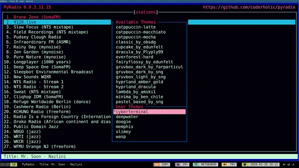
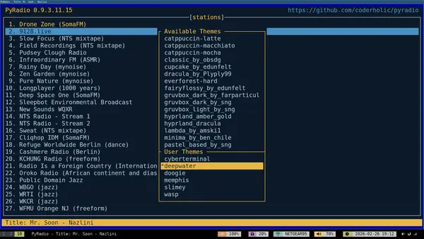
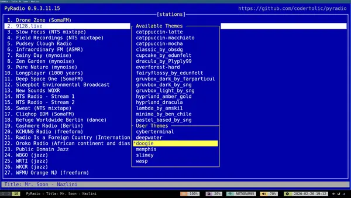
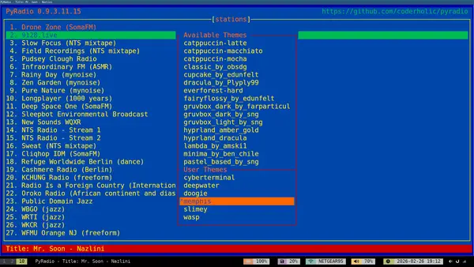
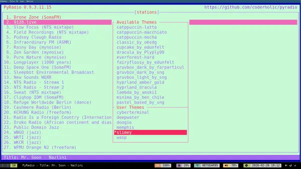

# PyRadio Themes

These are themes for [PyRadio](https://github.com/coderholic/pyradio), the greatest command line TUI radio streaming program I've ever used, and my favorite way to play music. I've been using the program for almost a decade. I even wrote an [intro](https://leetusman.com/nosebook/pyradio-open-source-alternative) to PyRadio in 2019.

You can add these themes to your `~/.config/pyradio/themes` folder. In pyradio, press `t` and navigate to th user themes section. Preview a theme with `Enter` or `right arrow`. Select a theme with `spacebar`.

## Previews

**Cyberterminal** - a cyberpunk-ish inspired theme

**Deepwater** - a deep navy cool, calm theme

**Doogie** - a theme inspired by the computer terminal from the 80s US TV show Doogie Howser, M.D.

**Memphis** - a Memphis-design-inspired theme

**Slimey** - a squishy theme inspired by Casper and the Ghostbusters ghosts and all slimey things

**Wasp** - a theme with intense stabs of bright color

